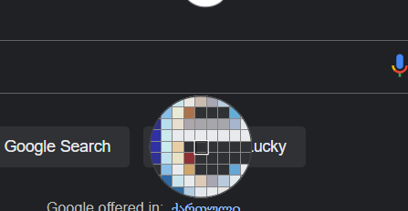
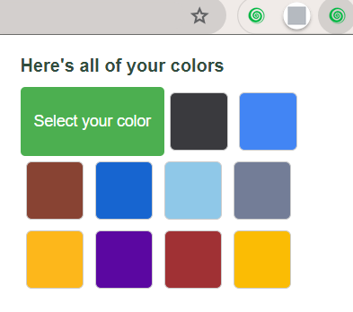

# 🖌️ Color Shop Extension

**Color Shop** is a simple and effective Chrome extension that lets you pick and save colors from any webpage. Your selected colors are conveniently displayed in a popup for easy access.

## Features

- **Color Picker**: Select colors directly from any webpage using the EyeDropper tool.
- **Saved Colors**: View your saved colors as color boxes in the extension's popup.
- **Local Storage**: Colors are stored locally in your browser, so they’re always available.

## Usage

1. **Click** the Color Shop extension icon in the Chrome toolbar.
2. **Tap** the "Select your color" button in the popup.
3. **Pick** a color from any webpage using the eyedropper tool.
4. **Save** and **view** your selected color in the popup as a color box.
5. **Repeat** to pick and save more colors.

## Development

- Manifest Version: 3
- Languages: JavaScript, HTML, CSS
- Permissions: storage, tabs, host_permissions

